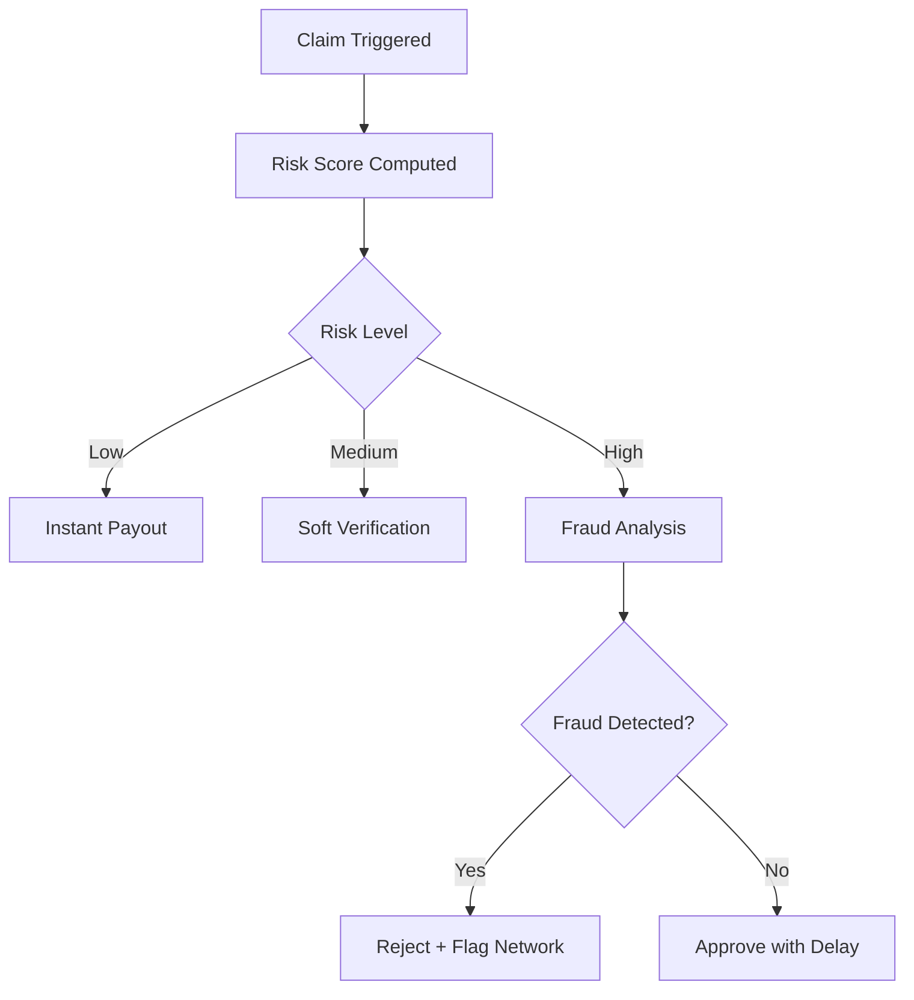
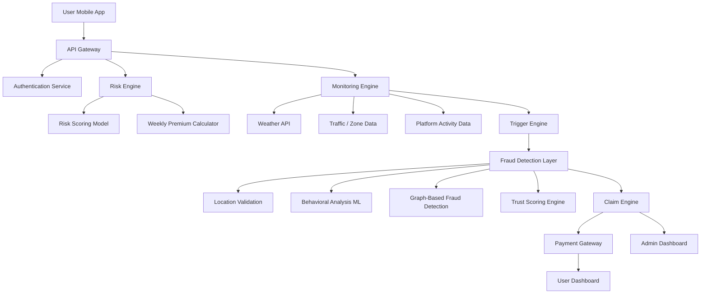
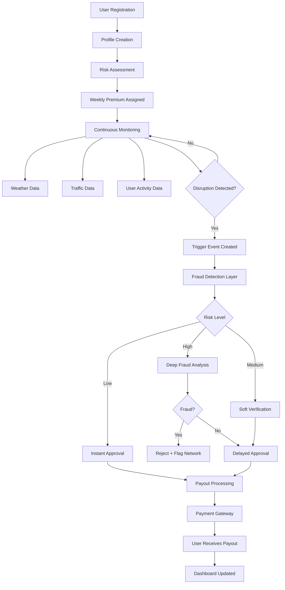

# 🚀 AI-Powered Parametric Insurance for Gig Workers  
### Guidewire DEVTrails 2026 Submission  

---

## 🎥 Demo Preview  
> *add the ppt video demo thing here*  


---

## 📌 Problem Statement  

India’s gig economy workers (Zomato, Swiggy, Zepto, Amazon, etc.) face **frequent income loss** due to uncontrollable external disruptions such as:

- Extreme weather (rain, heat, floods)  
- Pollution spikes  
- Curfews / strikes / zone shutdowns  

Currently, **no system compensates them for lost working hours**, forcing them to absorb financial shocks.

---

## 💡 Our Solution  

We propose a **fully automated AI-powered parametric insurance platform** that:

- Predicts risk dynamically  
- Monitors real-world disruption signals  
- Automatically triggers claims  
- Instantly pays out lost income  

👉 No paperwork. No manual claims. No delays.  

---

## 🎯 Target Persona  

**Urban Delivery Partner (Food / Grocery / E-commerce)**  

### Example Scenario  
- A delivery rider operates in a flood-prone area  
- Heavy rainfall halts deliveries  
- System detects disruption + inactivity  
- Claim auto-triggered  
- Instant payout credited  

---

## ⚙️ Core Features  

### 🧠 AI-Powered Risk Assessment  
- Weekly dynamic premium pricing  
- Risk scoring based on:
  - Location risk  
  - Historical disruptions  
  - Worker behavior  

---

### 🔍 Intelligent Fraud Detection  
- GPS spoof detection  
- Behavioral anomaly detection  
- Duplicate claim prevention  
- Cross-user fraud ring detection  

---

### ⚡ Parametric Automation  
- Real-time disruption monitoring  
- Automatic claim triggering  
- Zero-touch payout system  

---

### 🔗 Integration Layer  
- Weather APIs (or simulated data)  
- Traffic & accessibility signals  
- Mock delivery platform data  
- Payment gateway (sandbox mode)  

---

## 💸 Weekly Pricing Model  

Designed for gig economy cash flow:

- Premium = f(risk_score, disruption_probability)  
- Updated weekly  
- Micro-payments aligned with earnings  

---

## 📊 Parametric Triggers  

| Trigger Type   | Condition                  | Action            |
|---------------|---------------------------|-------------------|
| Weather       | Rainfall > threshold      | Claim triggered   |
| Pollution     | AQI unsafe                | Claim triggered   |
| Activity Drop | Sudden delivery drop      | Verified trigger  |
| Zone Lock     | Curfew / closure          | Claim triggered   |

---

# 🚨 PHASE 1 CRISIS: MARKET CRASH SCENARIO  

## ⚠️ The Threat  

A coordinated fraud ring:

- 500+ delivery agents  
- Organized via Telegram  
- Using **advanced GPS spoofing tools**  
- Faking presence in high-risk zones  
- Triggering mass false claims  

👉 Result: **Liquidity pool drained instantly**

👉 Conclusion:  
**Simple GPS verification is DEAD**

---

# 🛡️ ADVERSARIAL DEFENSE & ANTI-SPOOFING STRATEGY  

---

## 🧠 1. Differentiation: Real vs Fake Worker  

We move beyond GPS → into **behavioral intelligence**

### ✅ Genuine Worker  
- Continuous movement  
- Realistic delivery patterns  
- Natural idle gaps  
- Consistent device identity  

### 🚫 Fraudulent Actor  
- Static location + high claims  
- Identical patterns across users  
- Unrealistic clustering  
- Synchronized behavior  

👉 **We validate behavior, not coordinates**

---

## 📊 2. Data Signals (Beyond GPS)  

### 📍 Location Intelligence  
- GPS vs IP mismatch  
- Tower triangulation  
- Impossible jumps  

### 📱 Device Fingerprinting  
- Device ID  
- OS patterns  
- Emulator detection  

### 📶 Network Signals  
- Packet loss anomalies  
- Latency inconsistencies  
- Network switching patterns  

### 🚴 Behavioral Data  
- Delivery frequency  
- Route history  
- Speed & acceleration  

### 🧑‍🤝‍🧑 Graph Intelligence  
- Shared device clusters  
- Synchronized claims  
- Fraud ring detection  

---

## 🧩 3. Fraud Detection Layers  

1. **Location Validation Layer**  
2. **Behavioral ML Model**  
3. **Graph-Based Fraud Detection**  
4. **Temporal Anomaly Detection**  
5. **Trust Scoring Engine**  

---

## ⚖️ 4. UX Balance (Critical for Judges)  

We DO NOT punish honest users.

### 🟢 Low Risk  
- Instant payout  

### 🟡 Medium Risk  
- Soft verification  
- Slight delay  

### 🔴 High Risk  
- Deep fraud analysis  
- Cluster validation  

---

## 🔄 Intelligent Claim Flow  



---


## 🧱 System Architecture  



---

## 🔄 Full Workflow

```markdown
## 🔄 End-to-End Workflow  



---

## 📈 Dashboard

### 👷 Worker
 - Earnings protected

 - Active coverage

 - Claim history

### 🏢 Admin
 - Fraud alerts
 - Risk heatmaps
 - Loss analytics
 - Predictive insights

---

## 🛠️ Tech Stack

- Frontend: React / Next.js
- Backend: Node.js / FastAPI
- Database: PostgreSQL / MongoDB
- AI/ML: Python (Scikit-learn / XGBoost)
- APIs: Weather + Mock APIs
- Payments: Razorpay (Sandbox)

---

## 🚀 Deliverables Covered

✔ Persona workflow
✔ Weekly pricing model
✔ Parametric triggers
✔ AI risk engine
✔ Fraud detection system
✔ Adversarial defense
✔ Architecture design

---

## 🔮 Future Scope

- Federated fraud learning
- Blockchain claim validation
- Platform partnerships

---

