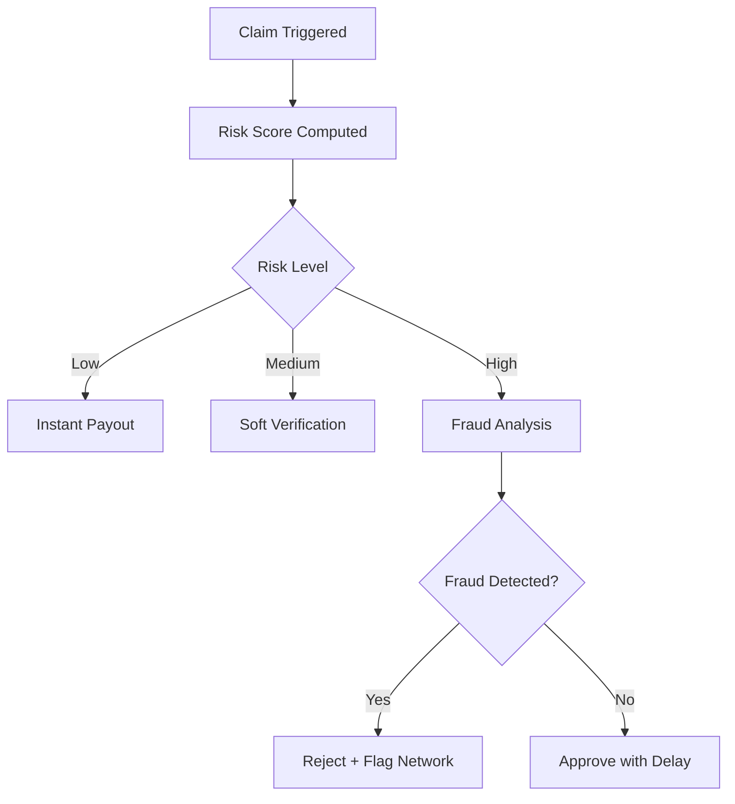
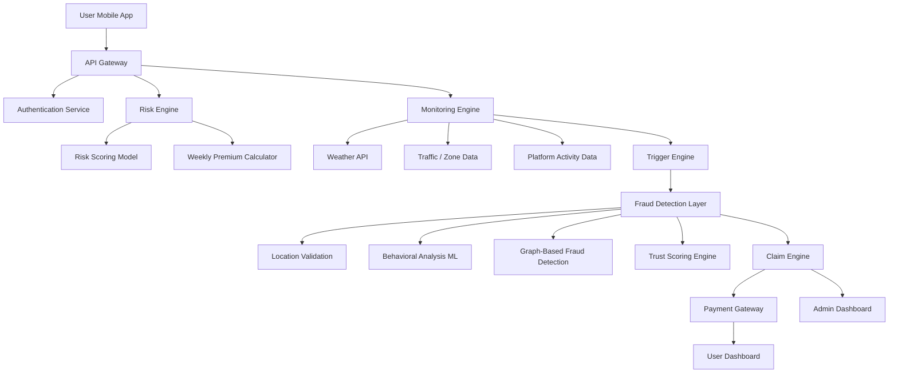
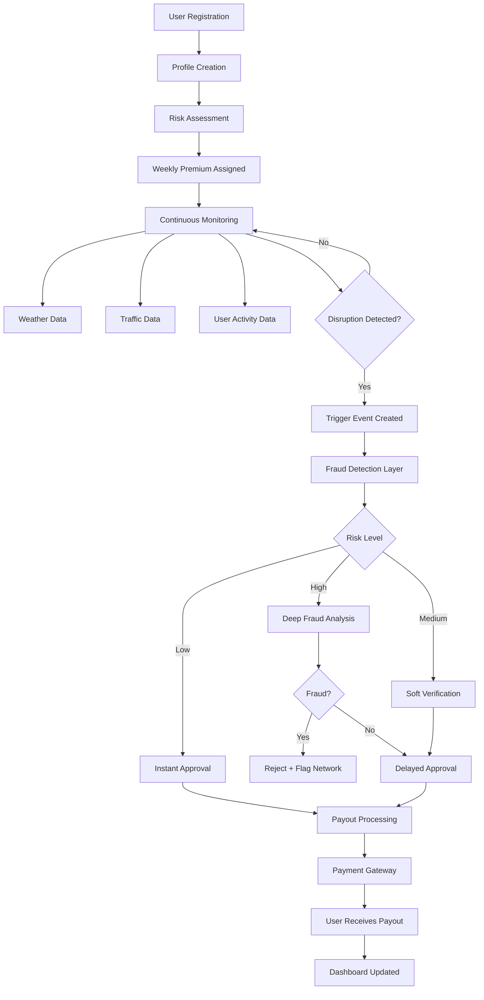

# AI-Powered Parametric Insurance for Gig Workers  

### Guidewire DEVTrails 2026 Submission  

**Team: Code Brewers**

---

## 🎥 Demo

- **2-Minute Demo Video**  
  [Watch here](https://drive.google.com/file/d/1QpKRN_w1MqBaSLieOQ_TOMhmhUARaWJQ/view?usp=drive_link)

- **Presentation (PPT)**  
  [View slides](https://canva.link/2q0zq8s24fj3yw9)

---

## 1. Problem Statement

Gig workers across platforms such as Zomato, Swiggy, Zepto, and Amazon frequently experience income loss due to external disruptions:

* extreme weather (rain, heat, floods)
* pollution spikes
* curfews, strikes, or zone shutdowns

There is currently no system that compensates them for lost working hours. As a result, workers are forced to absorb these financial shocks.

---

## 2. Solution

We propose a parametric insurance platform that:

* dynamically assesses risk
* continuously monitors real-world signals
* automatically triggers claims
* processes payouts instantly

The system is designed to operate with zero friction:
no paperwork, no manual claims, and no delays.

---

## 3. Target User

Urban delivery partners working in food, grocery, and e-commerce ecosystems.

**Example scenario**

* A rider operates in a flood-prone zone
* Heavy rainfall halts deliveries
* The system detects disruption and inactivity
* A claim is triggered automatically
* The payout is credited instantly

---

## 4. Core Capabilities

### Risk Assessment

* weekly dynamic premium pricing
* personalized risk scoring based on:

  * location
  * historical disruptions
  * user behavior

---

### Fraud Detection

* GPS spoof detection
* behavioral anomaly detection
* duplicate claim prevention
* cross-user fraud ring detection

---

### Parametric Automation

* real-time disruption monitoring
* automatic claim triggering
* zero-touch payouts

---

### Integration Layer

* weather APIs or simulated inputs
* traffic and zone signals
* platform activity data
* payment gateway (sandbox)

---

## 5. Pricing Model

Premiums are computed as a function of risk score and disruption probability.

* updated weekly
* aligned with gig worker earning cycles
* designed for micro-payments

---

## 6. Parametric Triggers

| Trigger Type  | Condition                  | Action           |
| ------------- | -------------------------- | ---------------- |
| Weather       | Rainfall exceeds threshold | Claim triggered  |
| Pollution     | AQI crosses unsafe level   | Claim triggered  |
| Activity Drop | Significant deviation      | Verified trigger |
| Zone Lock     | Curfew or closure          | Claim triggered  |

---

## 7. Crisis Scenario: Coordinated Fraud Attack

### Threat Model

A coordinated group of users:

* operates via Telegram
* uses GPS spoofing tools
* simulates presence in high-risk zones
* triggers simultaneous claims

**Impact:** rapid depletion of the liquidity pool

This invalidates traditional single-signal verification approaches.

---

## 8. Adversarial Defense & Anti-Spoofing Strategy

### 8.1 The Problem

A coordinated fraud ring can exploit location-based systems by spoofing GPS data and simulating presence in high-risk zones.

In such attacks:

* users remain physically inactive
* location signals are artificially manipulated
* claims are triggered simultaneously across a network

This makes single-signal verification (GPS) unreliable.

---

### 8.2 Core Differentiation

The system does not rely on location alone.
Instead, it validates **consistency across independent signals**.

A genuine delivery partner generates a natural behavioral footprint:

* movement patterns
* activity cycles
* device continuity

A fraudulent actor may spoof location, but cannot consistently replicate:

* realistic motion patterns
* long-term behavioral history
* cross-user independence

**Key idea:**
A claim is trusted only when multiple signals agree over time.

---

### 8.3 Multi-Signal Data Layer

To detect spoofing and coordinated fraud, the system evaluates signals beyond GPS:

---

**Location Integrity**

* GPS vs IP mismatch
* cell tower triangulation
* detection of impossible jumps

---

**Device Authenticity**

* device fingerprint consistency
* emulator or spoofing tool detection
* motion sensor validation

---

**Network Signals**

* proxy / VPN usage
* latency irregularities
* shared IP clustering across users

---

**Behavioral Data**

* delivery frequency patterns
* session timing and duration
* route consistency over time
* activity vs disruption mismatch

---

**Graph-Level Intelligence**

* clustering of users with similar signals
* synchronized claim timing
* shared infrastructure patterns

This enables detection of **coordinated fraud rings**, not just individual anomalies.

---

### 8.4 Decision Layer (Trust Scoring)

All signals are aggregated into a unified trust score:

```
Trust Score = weighted(
    location integrity,
    behavioral consistency,
    device authenticity,
    network trust,
    peer correlation
)
```

This score determines claim handling in real time.

---

### 8.5 Differentiation: Real vs Spoofed User

| Signal Type | Genuine User         | Spoofed Actor                    |
| ----------- | -------------------- | -------------------------------- |
| Movement    | continuous, natural  | static or inconsistent           |
| Behavior    | varied and realistic | repetitive or synchronized       |
| Device      | stable identity      | shared or emulated               |
| Network     | organic variation    | clustered / identical patterns   |
| Claims      | isolated events      | burst or coordinated submissions |

---

### 8.6 UX Balance Strategy

The system is designed to **avoid penalizing legitimate users**, especially during real disruptions.

---

**Low Risk**

* instant payout

---

**Medium Risk**

* passive verification
* slight delay
* no user friction

---

**High Risk**

* temporary hold
* deeper analysis using graph and behavioral signals
* transparent status shown to user

---

### 8.7 Failure Handling

To account for real-world issues like poor connectivity:

* temporary network drops do not immediately reduce trust
* decisions rely on historical behavior, not single events
* users are not blocked solely due to missing signals

**Principle:**
Uncertainty leads to delay, not rejection.

---

### 8.8 Outcome

This approach ensures:

* resilience against coordinated fraud attacks
* detection of spoofing beyond GPS manipulation
* fair treatment of genuine users under real disruptions

The system shifts from **location validation → behavioral verification**, making large-scale exploitation significantly harder.


---

## 9. Intelligent Claim Flow



---

## 10. System Architecture



---

## 11. End-to-End Workflow



---

## 12. Dashboard

### Worker

* coverage status
* earnings protected
* claim history

### Admin

* fraud alerts
* risk heatmaps
* loss analytics
* predictive insights

---

## 13. Technology Stack

The system is designed as a real-time decision platform with a focus on behavioral analysis and fraud detection.

---

### Core Stack

* Backend: FastAPI (Python)
* Frontend: React (Vite)
* Database: PostgreSQL
* Caching: Redis
* Payments: Razorpay (Sandbox)
* Deployment: Docker, AWS / GCP

---

### AI / Machine Learning

#### Risk Modeling

* XGBoost-based scoring model
* Inputs:

  * location risk
  * historical disruptions
  * user activity patterns
* Outputs:

  * dynamic weekly premium
  * baseline risk score

---

#### Behavioral Modeling

* delivery frequency
* session timing
* movement consistency
* baseline profile per user

---

#### Anomaly Detection

* Isolation Forest
* detects:

  * abnormal inactivity
  * irregular claim timing
  * activity-disruption mismatch

---

#### Fraud Detection

* rule-based validation
* anomaly scoring
* lightweight graph clustering

---

#### Trust Scoring

```
Trust Score = f(
  location integrity,
  behavioral consistency,
  anomaly score,
  peer correlation
)
```

Drives:

* claim approval
* verification level
* fraud flagging

---

### System Design Approach

* async APIs
* event-driven evaluation
* ML integrated into request flow
* minimal architecture for low latency

---

## 14. Deliverables

* persona-based workflow
* pricing model
* parametric trigger system
* AI-based risk engine
* fraud detection system
* adversarial defense strategy
* system architecture

---

## 15. Future Scope

* federated fraud learning
* blockchain-based claim validation
* integration with delivery platforms

---
